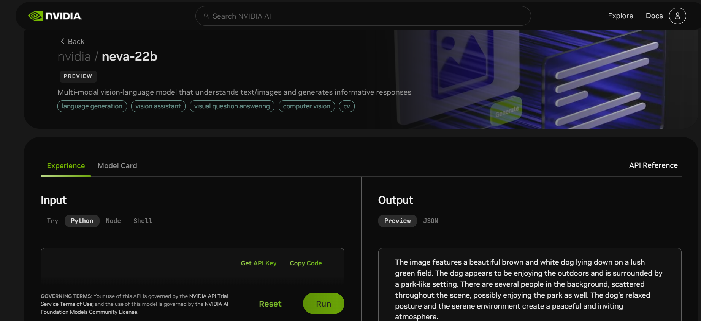

# NVIDIA NiM API Model adapters

This repository contains the code for Dataloop model adapters that invoke NVIDIA NIMs served via API

More information on NVIDIA NIMs can be found [here](https://build.nvidia.com/explore/discover).

### Using NVIDIA NIMs in Dataloop Platform

- Select the model you want to use.
- In the `Experience` Tab, click on `Get API Key`

- Install the model from the [Dataloop Marketplace](https://docs.dataloop.ai/docs/marketplace)
- Add the API Key as Secret to your
  organization's [Data Governance](https://docs.dataloop.ai/docs/overview-1?highlight=data%20governance)
- Add the secret to the model's [service configuration](https://docs.dataloop.ai/docs/service-runtime#secrets-for-faas)

### Reward model

Make sure to edit on the model's configuration the name of the model you want to reward.

### Important Note on NVIDIA NIM Model Usage

While the adapter code in this repository is open-sourced under the Apache License 2.0, users of NVIDIA NIM models must adhere to NVIDIA's software license agreements:

- [NVIDIA Software License Agreement](https://www.nvidia.com/en-us/agreements/enterprise-software/nvidia-software-license-agreement/)
- [Product-Specific Terms for AI Products](https://www.nvidia.com/en-us/agreements/enterprise-software/product-specific-terms-for-ai-products/)

By using NVIDIA NIM models, you acknowledge and agree to comply with these terms.

For any questions regarding the usage or licensing of NVIDIA NIM models, please contact NVIDIA.

---
