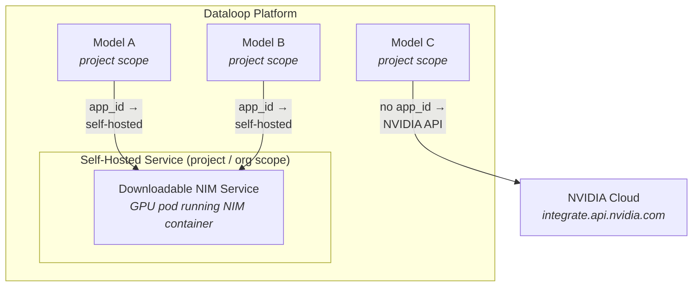

# NVIDIA NIM Adapter for Dataloop

Dataloop model adapters for [NVIDIA NIM](https://build.nvidia.com/) — providing access to NVIDIA's inference models through the Dataloop platform.

Models are available in two deployment modes: **API** (hosted by NVIDIA) and **Downloadable** (self-hosted on Dataloop infrastructure). Both modes expose an OpenAI-compatible interface and share the same adapter codebase.

## Architecture


```mermaid
graph TB
    subgraph "Dataloop Platform"
        MODEL_A["Model A<br/><i>project scope</i>"]
        MODEL_B["Model B<br/><i>project scope</i>"]
        MODEL_C["Model C<br/><i>project scope</i>"]

        subgraph "Self-Hosted Service (project / org scope)"
            DL_SVC["Downloadable NIM Service<br/><i>GPU pod running NIM container</i>"]
        end
    end

    NVIDIA["NVIDIA Cloud<br/><i>integrate.api.nvidia.com</i>"]

    MODEL_A -- "app_id →<br/>self-hosted" --> DL_SVC
    MODEL_B -- "app_id →<br/>self-hosted" --> DL_SVC
    MODEL_C -- "no app_id →<br/>NVIDIA API" --> NVIDIA
```

Each **API model app** (e.g. `nim-llama-3-1-8b-instruct`) provides a model entity and adapter code. It can talk to **either** backend:

| Backend | When | GPU on Dataloop |
|---------|------|:---------------:|
| **NVIDIA Cloud** | No `app_id` in model config — requests go to `integrate.api.nvidia.com` via NGC API key | No |
| **Self-Hosted (Downloadable)** | `app_id` is set — requests route to a local NIM service running on Dataloop | Yes |

The **Downloadable app** (e.g. `nim-meta-llama-3.1-8b-instruct-downloadable`) provisions the GPU service and declares the API model app as a dependency (auto-installed). The service can be installed at **project or org scope**, and **multiple models can point to the same service** by sharing the same `app_id`.

**Configuration:**

| Field | Description |
|-------|-------------|
| `nim_model_name` | NVIDIA model identifier (e.g. `meta/llama-3.1-8b-instruct`) |
| `app_id` | Downloadable service installation ID — when set, routes to self-hosted instead of NVIDIA cloud |
| `base_url` | NVIDIA API endpoint (default: `https://integrate.api.nvidia.com/v1`, ignored when `app_id` is set) |
| `max_tokens` | Maximum tokens to generate (LLM/VLM) |
| `temperature` | Sampling temperature (LLM/VLM) |
| `stream` | Enable streaming responses (LLM/VLM) |
| `system_prompt` | System prompt (LLM/VLM) |
| `embeddings_size` | Embedding vector dimension (Embeddings) |

## Model Types

| Type | Adapter | Description |
|------|---------|-------------|
| LLM | `models/api/llm/base.py` | Chat completion models (Llama, Mistral, etc.) |
| VLM | `models/api/vlm/base.py` | Vision-language models with image understanding |
| Embeddings | `models/api/embeddings/base.py` | Text embedding models |
| Object Detection | `models/api/object_detection/base.py` | Vision models with bounding box output |

All adapters inherit from `NIMBaseAdapter` (`models/api/base_adapter.py`), which handles client setup, downloadable endpoint resolution, and JWT session management.

## Repository Structure

```
models/
  api/                          # API model adapters and manifests
    base_adapter.py             # Shared base class (client setup, JWT, health check)
    llm/
      base.py                   # LLM adapter
      {publisher}/{model}/dataloop.json
    vlm/
      base.py                   # VLM adapter (inherits from LLM)
      {publisher}/{model}/dataloop.json
    embeddings/
      base.py                   # Embeddings adapter
      {publisher}/{model}/dataloop.json
    object_detection/
      base.py                   # Object detection adapter
      {publisher}/{model}/dataloop.json
  downloadable/                 # Downloadable NIM services
    main.py                     # Shared service runner (starts NIM server, streams logs)
    {type}/{publisher}/{model}/dataloop.json
agent/                          # Automated model onboarding agent
```

## Environment Variables

| Variable | Required | Description |
|----------|----------|-------------|
| `NGC_API_KEY` | Yes | NVIDIA NGC API key for model access |

## Requirements

- Python 3.10+
- `dtlpy` (Dataloop SDK)
- `openai` (OpenAI Python client)
- `httpx`, `PyJWT` (for downloadable auth)
