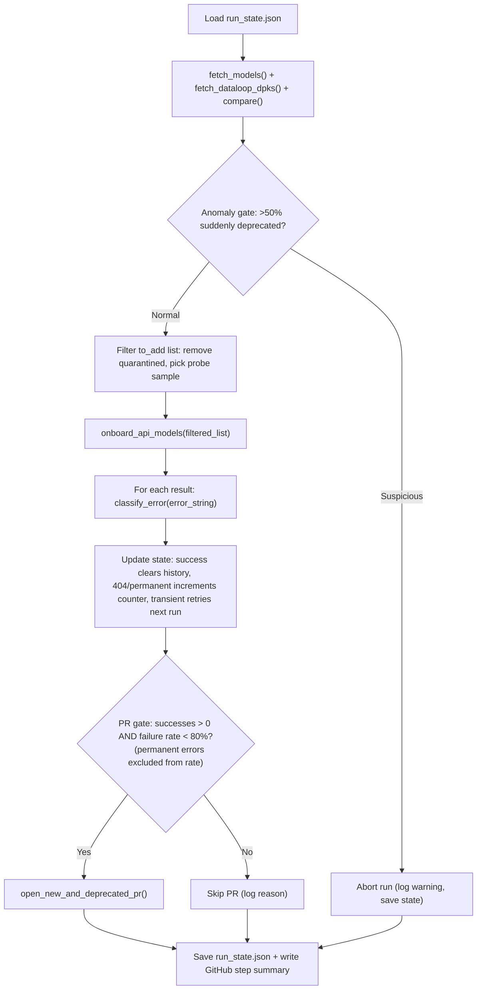

# NVIDIA NIM Agent

Automated agent for discovering NVIDIA NIM models and onboarding them to the Dataloop marketplace.

## Overview

This agent automates the entire workflow of:
1. **Discovering** new NVIDIA NIM models via API
2. **Comparing** them with existing Dataloop marketplace DPKs
3. **Testing** model adapters locally
4. **Generating** DPK manifests
5. **Publishing** and validating as Dataloop apps
6. **Opening PRs** to add successful models to the repository

**See the [Support Matrix](../support_matrix.md) for a complete list of supported models and their availability.**

## Flow Diagram

```
NVIDIA API --> Fetch Models --> Compare with Dataloop --> Find New Models
                                                               |
                                                               v
                        +----------------------------------+
                        |     FOR EACH NEW MODEL           |
                        |  1. Detect Type (LLM/VLM/Embed)  |
                        |  2. Test Adapter Locally         |
                        |  3. Generate Manifest (MCP)      |
                        |  4. Publish & Test App (Opional) |
                        +----------------------------------+
                                                               |
                                                               v
                                            Open GitHub PRs (batched by type)
```

## Components

| File | Description |
|------|-------------|
| `nim_agent.py` | Main orchestrator - coordinates the entire flow |
| `nim_tester.py` | Testing operations - type detection, adapter testing, DPK validation |
| `dpk_mcp_handler.py` | DPK manifest generation via MCP tools |
| `github_client.py` | GitHub operations - branches, commits, PRs |
| `run_state.py` | Run State Persistence for NIM Agent |
| `models/api/` | Model adapter implementations (LLM, VLM, Embedding) |

## Detailed Flow

### Step 1: Fetch NVIDIA Models
- Calls `https://integrate.api.nvidia.com/v1/models` (OpenAI-compatible API)
- Call NIM Catalog to fing the matched downloadable models (`RUN-ANYWHERE`)
- Returns list of all available NIM models (API and Downloadables) with metadata

### Step 2: Fetch Dataloop DPKs
- Queries Dataloop marketplace for existing NIM DPKs
- Filters by `scope=public` and `codebase.gitUrl={this repo}`

### Step 3: Compare & Find New Models
- Normalizes model names for comparison
- Identifies:
  - **To Add**: Models in NVIDIA but not in Dataloop
  - **Deprecated**: DPKs in Dataloop but no longer in NVIDIA
  - **Matched**: Already onboarded models

### Step 4: Onboard Each Model

For each new model, the `onboard_model()` method runs:

#### 4.1 Detect Model Type
- Uses name-based heuristics:
  - `embed` -> embedding
  - `rerank` -> rerank
  - `vision`, `vlm`, `vl` -> vlm
  - Default -> llm

#### 4.2 Test Adapter Locally
- Loads appropriate adapter (LLM/VLM/Embedding)
- Makes test API call to NVIDIA
- Validates response format

#### 4.3 Generate DPK Manifest
- Calls MCP `create_model_manifest` tool with explicit parameters
- No LLM interpretation - direct parameter mapping
- Returns `dataloop.json` manifest

#### 4.4 Publish & Test App - Optional, not a part of the current run flows
- Publishes DPK to Dataloop
- Installs as app in test project
- Deploys model service
- Runs test prediction with `PromptItem`
- Cleans up resources after test

### Step 5: Open GitHub PRs
- Creates PRs for successful models
- Batched by model type (embedding/vlm/llm)
- Updates config files:
  - `.bumpversion.cfg` - version tracking
  - `.dataloop.cfg` - manifest registry

## Repository Structure (PRs)

PRs follow this folder structure:
```
models/
  api/
    embeddings/
      {publisher}/
        {model_name}/
          dataloop.json
    vlm/
      {publisher}/
        {model_name}/
          dataloop.json
    llm/
      {publisher}/
        {model_name}/
          dataloop.json
  downloadables/
    embeddings/
      {publisher}/
        {model_name}/
          dataloop.json
    vlm/
      {publisher}/
        {model_name}/
          dataloop.json
    llm/
      {publisher}/
        {model_name}/
          dataloop.json
```

## Usage

### Quick Start

```python
from dotenv import load_dotenv
load_dotenv()

from nim_agent import NIMAgent

# Initialize agent
agent = NIMAgent()

# Run full flow
agent.run(open_pr=True)
```

### Test Single Model

```python
from nim_agent import NIMAgent

agent = NIMAgent()
result = agent.onboard_api_model("nvidia/llama-3.1-70b-instruct")
print(result)
```

## Environment Variables

| Variable | Required | Description |
|----------|----------|-------------|
| `NGC_API_KEY` | Yes | NVIDIA NGC API key |
| `DATALOOP_TEST_PROJECT` | Yes | Dataloop project ID for testing |
| `GITHUB_TOKEN` | For PRs | GitHub personal access token |
| `GITHUB_REPO` | For PRs | Target repo (default: `dataloop-ai-apps/nim-api-adapter`) |
| `DPK_MCP_PYTHON` | For DPK | Python path for MCP server (default: `python`) |
| `DPK_MCP_SERVER` | For DPK | Path to MCP DPK generator server script |

## Model Type Detection

| Pattern | Type | Example |
|---------|------|---------|
| `embed`, `e5`, `bge` | embedding | `nvidia/nv-embed-v1` |
| `rerank` | rerank | `nvidia/nv-rerankqa-mistral-4b-v3` |
| `vision`, `vlm`, `vl`, `kosmos` | vlm | `meta/llama-3.2-90b-vision-instruct` |
| Default | llm | `meta/llama-3.1-70b-instruct` |

## Output

- **Report JSON**: Summary with success/failure counts
- **Manifests JSON**: All generated DPK manifests
- **GitHub PRs**: Per model type (embedding, vlm, llm)


## Agentic Mode

The agent has two entry points:
- `run()` -- the original blind pipeline (fetch, compare, onboard everything, PR)
- `run_agentic()` -- state-aware pipeline with quarantine, decision gates, and error classification

### The 404 Problem

Many models on the OpenAI endpoint return 404 when actually called. The original `run()` tests them all every time. With 200+ models and ~40% returning 404, that is ~80 wasted API calls per run.

**Strategy: 404-aware state with probe sampling**

- Record every 404 in state with timestamp and consecutive-404 count
- After 3 consecutive 404s across runs, **quarantine** the model (stop testing it)
- Each run, **probe 5-10 random quarantined models** to check if any came back online
- If a probe succeeds, un-quarantine that model and process it normally
- Net effect: first run is slow (tests everything), subsequent runs only test new + non-404 models + a small probe sample

### Architecture



### Decision Gates

| Gate | Condition | Action on fail |
|------|-----------|----------------|
| Anomaly gate | >50% of DPKs suddenly deprecated | Abort run, save state, no PR |
| Quarantine filter | Model failed 3+ consecutive runs | Skip model (probe sample still tested) |
| PR gate | At least 1 success AND failure rate < 80% (permanent errors excluded) | Skip PR creation |
| Environment gate | Auth/key errors detected | Abort entire run immediately |

### Error Classification

Errors are classified without LLM, using pattern matching:

| Type | Patterns | Action |
|------|----------|--------|
| Permanent | 404, "not found", "does not exist" | Quarantine after N attempts |
| Transient | timeout, rate limit, 5xx, connection | Retry next run |
| Environment | auth error, API key missing, 401/403 | Abort entire run |

### Run State

State is persisted in `agent/run_data/run_state.json` and stored as a GitHub Action artifact between CI runs.

```json
{
  "runs": [{"started": "...", "status": "completed", "attempted": 50, "succeeded": 35}],
  "models": {
    "nvidia/some-model": {
      "status": "quarantined",
      "consecutive_failures": 4,
      "last_error": "404 Not Found",
      "error_type": "permanent"
    }
  },
  "config": {
    "quarantine_after": 3,
    "probe_sample_size": 10,
    "quarantine_cooldown_days": 14,
    "pr_max_failure_rate": 0.80,
    "anomaly_deprecation_threshold": 0.50
  }
}
```

### Components

| File | Description |
|------|-------------|
| `run_state.py` | State persistence -- quarantine, per-model history, error classification |
| `nim_agent.py` (run_agentic) | Smart pipeline with decision gates wrapping existing methods |
| `.github/workflows/nim-agent.yml` | Weekly cron + manual dispatch, artifact-based state persistence |

### CLI

```
python agent/nim_agent.py run             [--limit N] [--no-pr] [--skip-docker]
python agent/nim_agent.py run-agentic     [--limit N] [--no-pr] [--skip-docker] [--state-path PATH]
python agent/nim_agent.py dry-run         [--limit N]
python agent/nim_agent.py status
python agent/nim_agent.py clear-quarantine MODEL_ID
python agent/nim_agent.py clear-quarantine all
python agent/nim_agent.py report
```

### GitHub Action

The workflow (`.github/workflows/nim-agent.yml`) runs weekly on Monday at 06:00 UTC with manual dispatch support.

**Required secrets:**
- `NGC_API_KEY` -- NVIDIA NGC API key
- `DATALOOP_TEST_PROJECT` -- Dataloop project ID for testing
- `GITHUB_TOKEN` -- auto-provided by Actions

The workflow downloads the previous `run_state.json` artifact, runs `run-agentic`, and uploads the updated state. A markdown step summary is written to `$GITHUB_STEP_SUMMARY` for easy review in the Actions UI.

---

## Extending

### Adding New Model Types

1. Add adapter in `models/api/` folder
2. Update `ADAPTER_MAPPING` in `dpk_mcp_handler.py`
3. Update detection patterns in `nim_tester.py`
4. Add folder mapping in `github_client.py`
